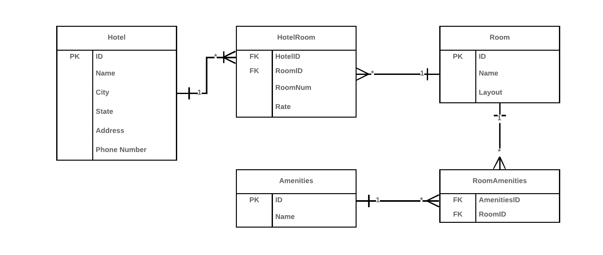

# Async-Inn

## Ahmad Masadeh

## 4/16/2022

# ERD 

Hotel: the hotel has an ID, name, city, state, Address , and phone Number 

HotelRoom: it has tow FK one for hotel ID and one for Room ID, along with other properties such as Rate and RoomNum. 

Room: so this room has a unique ID and other properites such as name and layout.

Amenities: it has an ID and a name. 

RoomAmenities: It has FK; because this table is responsible of connecting both of Room and Amenities

